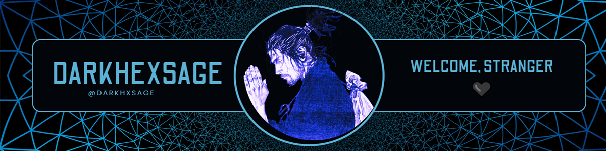

    
    
    
    

    

### 🐍 Contribution Snake

---

## 👋 **About Me**

**Purple Team Security Engineer** with **14+ industry certifications** and proven expertise in designing, deploying, and securing containerized applications at scale. Specialized in Kubernetes security, CI/CD pipeline hardening, and comprehensive security assessments. Passionate about building secure infrastructure and creating tools that solve real security challenges.

Currently building **production-grade security tools** and **infrastructure solutions**. Active contributor to open-source security projects with focus on practical, enterprise-ready implementations.

**Location:** Costa Rica 🇨🇷

---

## 🏆 **Certifications & Credentials**

### **Offensive Security**

### **Cloud & Container Security**

### **System Administration**

---

## 🛠️ **Technical Skills**

### **Container & Orchestration**
&nbsp;
&nbsp;
&nbsp;
&nbsp;

### **Security & Compliance**
&nbsp;
&nbsp;
&nbsp;

### **CI/CD & Infrastructure**
&nbsp;
&nbsp;
&nbsp;
&nbsp;

### **Full-Stack Development**
&nbsp;
&nbsp;
&nbsp;
&nbsp;

### **Systems & Tools**
&nbsp;
&nbsp;
&nbsp;
&nbsp;

---

## 🎧 Spotify Playing

## 💼 **Available For**

- **Freelance Security Consulting** - Web app audits, infrastructure assessment
- **Full-Stack Development** - React + Python backend applications  
- **Kubernetes Architecture** - Secure cluster design and implementation
- **DevOps Engineering** - CI/CD pipeline security and optimization
- **Contract Security Work** - Penetration testing, security assessments

---

## 🌐 **Let's Connect**

---

## ☕ **Support My Work**

Building secure infrastructure and open-source security tools takes dedication. If you find value in my work:

---

    🔐 Security First, Always | 💻 Code with Purpose | 🌴 Built in Costa Rica

📄 **License:** Projects available under MIT License. See individual repositories for details.
